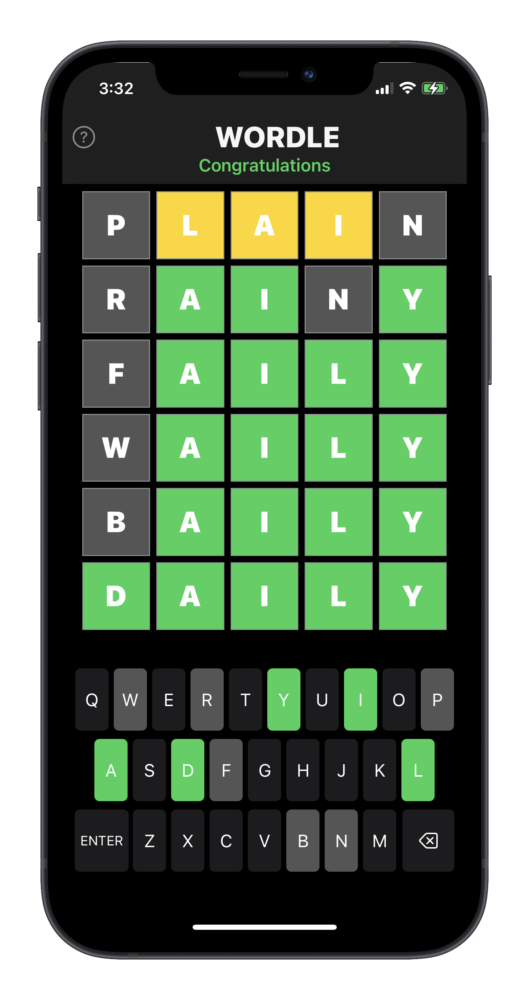
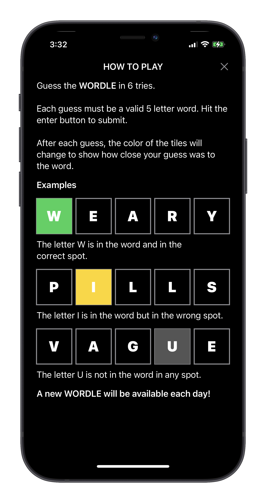

# DarnWordle
A SwiftUI retro of Wordle, the W* game

### Motivation

Well, the game looked interesting, fun and challenging, that's all it took for me to try building it.

Check the original game, Wordle, [here](https://www.powerlanguage.co.uk/wordle)

Game View                  |  Help View
:-------------------------:|:-------------------------:
  |  

Pull Requests are welcomed!🧘🏽
